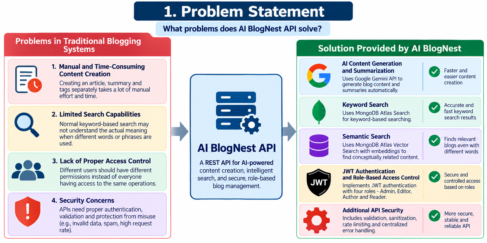
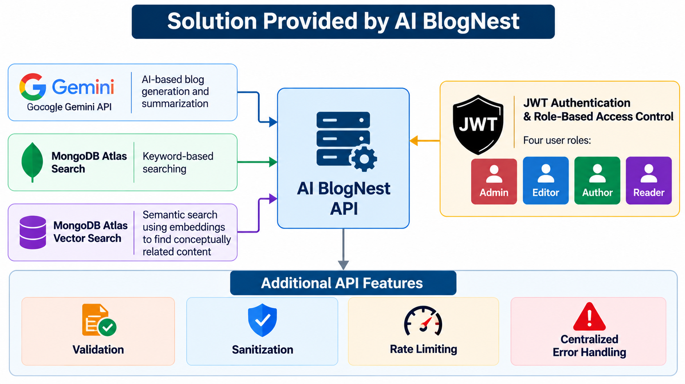
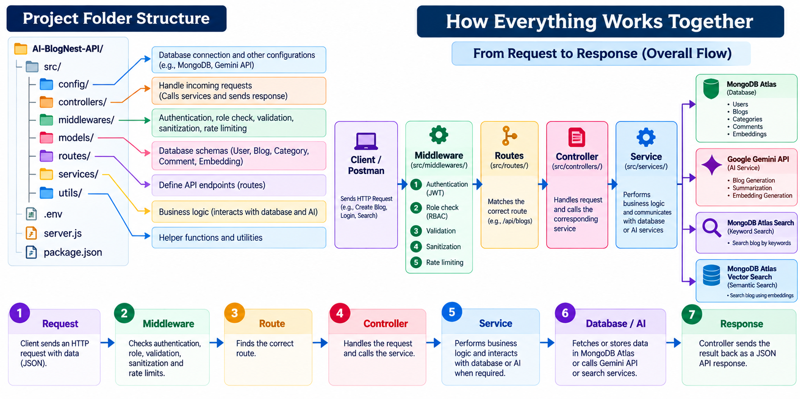

<div align="center">

# 🪺 AI BlogNest API
### **Enterprise-Grade AI-Powered Blogging Platform & Vector Search Engine**

[](https://nodejs.org)
[](https://expressjs.com)
[](https://www.mongodb.com/atlas)
[](https://ai.google.dev)
[](https://www.mongodb.com/products/platform/atlas-vector-search)
[](https://jwt.io)
[-brightgreen?style=for-the-badge&logo=jest&logoColor=white)](#-testing--automated-verification)

<p align="center">
  <b>A production-grade, secure RESTful API orchestrating Generative AI blog creation, automated multi-paragraph summarization, Apache Lucene full-text search, and 768-dimensional semantic vector search over MongoDB Atlas.</b>
</p>

[Quick Start](#-quick-start-guide-for-evaluators) • [Architecture](#-system-architecture--mvc-pattern) • [Key Features](#-key-features) • [Visual Diagrams](#-system-diagrams--workflows) • [API Reference](#-complete-api-reference) • [Testing](#-testing--automated-verification)

---

</div>

## 📌 Executive Summary

**AI BlogNest API** is an enterprise backend platform developed to solve the fundamental bottlenecks in traditional publishing systems:
1. **Keyword-Only Search Bottlenecks**: Standard SQL / MongoDB regex fails when users search with conceptual synonyms. AI BlogNest integrates **Google Gemini 768-dimensional dense vector embeddings** with **MongoDB Atlas Vector Search (`$vectorSearch`)** to calculate Cosine Similarity and match user intent rather than exact keywords.
2. **Content Generation Overhead**: Eliminates writer's block with prompt-engineered **Google Gemini 2.5 Flash** models, producing structured JSON articles complete with titles, multi-section markdown bodies, summaries, and tags.
3. **Weak Access Governance**: Implements a strict **4-Tier Role-Based Access Control (RBAC)** model (`admin`, `editor`, `author`, `reader`) to guarantee tamper-proof document ownership and comment moderation.
4. **Defensive API Hardening**: Enforces in-memory sliding-window rate limiting (`HTTP 429`), recursive XSS input sanitization (stripping `<script>` and malicious HTML payloads), and centralized, leak-free error handling.

---

## 🖼️ System Diagrams & Workflows

### 1. Problem Statement
<div align="center">
  
</div>

<br/>

### 2. Proposed Solution Architecture
<div align="center">
  
</div>

<br/>

### 3. End-to-End System Workflow
<div align="center">
  
</div>

---

## 🏗️ System Architecture & MVC Pattern

The application is engineered strictly around the **Model-View-Controller (MVC) pattern coupled with an isolated Service Layer**, ensuring business logic and AI orchestration remain decoupled from HTTP routing.

```
                              ┌────────────────────────────────────────┐
                              │       Clients / EchoAPI / Web Apps     │
                              └──────────────────┬─────────────────────┘
                                                 │ HTTP Requests / JSON
                                                 ▼
┌──────────────────────────────────────────────────────────────────────────────────────────────────┐
│                                 DEFENSIVE SECURITY PIPELINE                                      │
│  [1. CORS] ──► [2. 1MB JSON Body Parser] ──► [3. XSS Sanitizer] ──► [4. Sliding-Window Limiter]  │
└────────────────────────────────────────────────┬─────────────────────────────────────────────────┘
                                                 │ Sanitized Request
                                                 ▼
┌──────────────────────────────────────────────────────────────────────────────────────────────────┐
│                                  AUTHENTICATION & RBAC LAYER                                     │
│  [5. JWT Bearer Verifier] ──► [6. Role Enforcer (requireRole)] ──► [7. Structured Logger]        │
└────────────────────────────────────────────────┬─────────────────────────────────────────────────┘
                                                 │ Authenticated User (req.user)
                                                 ▼
┌──────────────────────────────────────────────────────────────────────────────────────────────────┐
│                                       CONTROLLER LAYER                                           │
│   authController │ blogController │ categoryController │ commentController │ aiController        │
└────────────────────────────────────────────────┬─────────────────────────────────────────────────┘
                                                 │ Business Logic Calls
                                                 ▼
┌──────────────────────────────────────────────────────────────────────────────────────────────────┐
│                                        SERVICE LAYER                                             │
│  ┌───────────────────────┬────────────────────────────┬───────────────────────────────────────┐  │
│  │   blog / user / cat   │      geminiService         │    searchService / vectorSearch       │  │
│  │    Business Logic     │ (gemini-2.5-flash Prompts) │ ($search Lucene & $vectorSearch Cos)  │  │
│  └───────────┬───────────┴─────────────┬──────────────┴───────────────────┬───────────────────┘  │
└──────────────┼─────────────────────────┼──────────────────────────────────┼──────────────────────┘
               │ Mongoose ODM            │ Google GenAI SDK                 │ Vector Pipeline
               ▼                         ▼                                  ▼
      ┌─────────────────┐       ┌─────────────────┐               ┌─────────────────┐
      │  MongoDB Atlas  │       │  Google Gemini  │               │   Atlas Vector  │
      │ Document Store  │       │  Cloud API      │               │   Search Index  │
      └─────────────────┘       └─────────────────┘               └─────────────────┘
```

---

## 📂 Repository File Structure

```text
NM_AIblognest/
├── .gitignore                    # Global git ignore (strictly protects .env secrets)
├── FLOW.png                      # Visual End-to-End System Workflow Diagram
├── Problem.png                   # Problem Statement Visual Chart
├── README.md                     # Comprehensive Evaluator Documentation
├── Solution.png                  # Proposed Solution Architecture Diagram
└── server/
    ├── .env.example              # Sanitized environment template for reviewers
    ├── package.json              # Project dependencies, metadata & test scripts
    ├── package-lock.json         # Pinned reproducible dependency graph
    ├── server.js                 # Application entry point with graceful shutdown
    ├── scripts/
    │   └── seed.js               # Database seeder (provisions 4 roles, categories, blogs)
    └── src/
        ├── app.js                # Express app assembler, middleware chains & error boundary
        ├── config/
        │   ├── db.js             # Mongoose connection with Windows DNS resolver fallback
        │   ├── env.js            # Boot-time environment variable schema validator
        │   └── gemini.js         # Google GenAI SDK initializer (@google/genai)
        ├── controllers/
        │   ├── aiController.js         # Endpoints for Gemini blog generation & summarization
        │   ├── authController.js       # Register, Login (JWT issuance), Profile & Logout
        │   ├── blogController.js       # Blog CRUD, pagination, filtering & publish workflows
        │   ├── categoryController.js   # Category management endpoints
        │   ├── commentController.js    # Threaded blog comments & admin spam moderation
        │   ├── searchController.js     # Dual search (Lucene Full-Text + Vector Cosine)
        │   └── userController.js       # Profile management & admin role assignments
        ├── middleware/
        │   ├── authMiddleware.js       # Bearer JWT verification & optional auth mode
        │   ├── errorMiddleware.js      # Global error boundary (400, 401, 403, 404, 409, 500)
        │   ├── rateLimitMiddleware.js  # Sliding-window rate limiter (100 / 15m, AI: 5 / 1m)
        │   ├── roleMiddleware.js       # Role-Based Access Control enforcer (403 Forbidden)
        │   ├── sanitizeMiddleware.js   # Recursive XSS sanitizer (neutralizes <script> tags)
        │   ├── validateMiddleware.js   # Legacy compatibility validator export
        │   └── validationMiddleware.js # MongoDB ObjectId format validator
        ├── models/
        │   ├── Blog.js                 # Blog schema with slugs, tags, status & User/Category refs
        │   ├── Category.js             # Taxonomy schema with unique indexing & slugs
        │   ├── Comment.js              # Threaded comments with moderation enum (approved/spam)
        │   ├── Embedding.js            # 768-dimensional float vector schema linked to Blog
        │   └── User.js                 # User schema with salted bcrypt hashing & 4-tier roles
        ├── routes/
        │   ├── aiRoutes.js             # AI generation & summarization routes
        │   ├── authRoutes.js           # Authentication & registration routes
        │   ├── blogRoutes.js           # Blog management & public feed routes
        │   ├── categoryRoutes.js       # Taxonomy category routes
        │   ├── commentRoutes.js        # Blog comment & moderation routes
        │   ├── searchRoutes.js         # Full-text & semantic vector search routes
        │   └── userRoutes.js           # Profile & administrator user management routes
        ├── services/
        │   ├── blogService.js          # Blog CRUD, author ownership & status transitions
        │   ├── categoryService.js      # Category business logic & duplicate checking
        │   ├── commentService.js       # Comment operations & spam flag moderation
        │   ├── embeddingService.js     # Real-time 768-dim vector generation & Atlas upserts
        │   ├── geminiService.js        # Prompt engineering templates for gemini-2.5-flash
        │   ├── index.js                # Centralized service barrel export
        │   ├── searchService.js        # MongoDB Atlas $search Lucene query engine
        │   ├── userService.js          # User database logic & role updates
        │   └── vectorSearchService.js  # MongoDB Atlas $vectorSearch Cosine Similarity
        └── utils/
            └── logger.js               # Structured logger with credential masking & timing
```

---

## ⚡ Key Features

| Category | Capability | Technical Implementation |
| :--- | :--- | :--- |
| 🤖 **Generative AI** | Prompt-Engineered Blog Generation | `gemini-2.5-flash` with strict JSON schema instructions, markdown sections, and tags. |
| 📝 **Content Summarization** | Multi-paragraph Synthesis | AI editorial engine summarizing lengthy articles into concise 2-sentence takeaways. |
| 🧠 **Vector Embeddings** | 768-Dimensional Representations | `gemini-embedding-001` encoding semantic meaning into continuous float spaces. |
| 🔍 **Semantic Search** | Intent-Based Vector Search | MongoDB Atlas `$vectorSearch` with Hierarchical Navigable Small World (HNSW) Cosine Similarity. |
| 🔎 **Full-Text Search** | Fuzzy Typo-Tolerant Keyword Search | MongoDB Atlas `$search` using Apache Lucene indexes across titles, contents, and tags. |
| 🔐 **Authentication** | Stateless Digital Signatures | JSON Web Tokens (`jsonwebtoken`) with salted `bcryptjs` password hashing (rounds: 10). |
| 🛡️ **Role Governance** | 4-Tier Access Control (RBAC) | Strict boundaries across `admin`, `editor`, `author`, and `reader` with `403 Forbidden` guards. |
| 🛑 **Defensive Security** | Sliding-Window Rate Limiting | In-memory IP tracking (`429 Too Many Requests`) for brute-force and DDoS prevention. |
| 🧼 **Data Sanitization** | Stored & Reflected XSS Protection | Recursive input sanitization stripping `<script>`, `<iframe>`, and dangerous protocols. |

---

## 🚀 Quick Start Guide (For Evaluators)

Follow these steps to run the complete project locally:

### 1. Prerequisites
* **Node.js** (v18.0.0 or higher)
* **npm** (v9.0.0 or higher)
* **MongoDB Atlas Account** (or free M0 cluster)
* **Google Gemini API Key** (from [Google AI Studio](https://aistudio.google.com/))

### 2. Installation
```powershell
# 1. Clone repository
git clone https://github.com/your-username/NM_AIblognest.git
cd NM_AIblognest/server

# 2. Install dependencies
npm install
```

### 3. Environment Configuration
Create a `.env` file inside the `server/` directory (refer to `.env.example`):
```env
PORT=8000
NODE_ENV=development
MONGO_URI=mongodb+srv://<username>:<password>@<cluster>.mongodb.net/blognest?retryWrites=true&w=majority
JWT_SECRET=your_super_secret_jwt_key_minimum_32_characters
JWT_EXPIRES_IN=7d
GEMINI_API_KEY=AIzaSy...your_gemini_api_key_here
```

### 4. Seed the Database
Populate initial categories, published articles, and default test accounts:
```powershell
npm run seed
```

Default credentials provisioned:
* **Admin**: `admin@blognest.com` / `Password123!`
* **Editor**: `editor@blognest.com` / `Password123!`
* **Author**: `author@blognest.com` / `Password123!`
* **Reader**: `reader@blognest.com` / `Password123!`

### 5. Launch the Server
```powershell
npm start
```
Server boots at: `http://localhost:8000`  
Health check: `GET http://localhost:8000/api/health`

---

## 📡 Complete API Reference

All responses follow a predictable enterprise envelope:
```json
{
  "success": true,
  "message": "Human-readable status description",
  "data": { ... }
}
```

### Authentication (`/api/auth`)
| Method | Endpoint | Access | Description |
| :--- | :--- | :---: | :--- |
| `POST` | `/api/auth/register` | Public | Register a new user (`name`, `email`, `password`, optional `role`) |
| `POST` | `/api/auth/login` | Public | Authenticate user & receive JWT Bearer token |
| `GET` | `/api/auth/me` | Bearer | Fetch profile of currently authenticated user |
| `POST` | `/api/auth/logout` | Bearer | Stateless session invalidation |

### Artificial Intelligence (`/api/ai`)
| Method | Endpoint | Access | Description |
| :--- | :--- | :---: | :--- |
| `POST` | `/api/ai/generate-blog` | Author/Admin | Generate structured JSON article via Google Gemini 2.5 Flash |
| `POST` | `/api/ai/summarize` | Bearer | Synthesize multi-paragraph text into a concise 2-sentence summary |

### Hybrid Search (`/api/search`)
| Method | Endpoint | Access | Description |
| :--- | :--- | :---: | :--- |
| `GET` | `/api/search?q={query}` | Public | Apache Lucene full-text search with typo tolerance & BM25 ranking |
| `GET` | `/api/search/semantic?q={query}` | Public | 768-dim Vector Search via Gemini embeddings & Atlas Cosine Similarity |

### Blog Management (`/api/blogs`)
| Method | Endpoint | Access | Description |
| :--- | :--- | :---: | :--- |
| `GET` | `/api/blogs` | Public | Paginated list of published blogs with category/tag filtering |
| `GET` | `/api/blogs/:id` | Public | Retrieve single blog by ID or slug (increments view count) |
| `POST` | `/api/blogs` | Author/Admin | Create blog draft (`title`, `content`, `category`, `tags`) |
| `PUT` | `/api/blogs/:id` | Author/Admin | Update owned blog post |
| `DELETE`| `/api/blogs/:id` | Author/Admin | Delete blog post and its associated vector embedding |
| `POST` | `/api/blogs/:id/comments` | Reader+ | Post a new comment on a published blog |
| `GET` | `/api/blogs/:id/comments` | Public | Retrieve all approved comments for a blog |

### Categories & Moderation (`/api/categories`, `/api/comments`)
| Method | Endpoint | Access | Description |
| :--- | :--- | :---: | :--- |
| `GET` | `/api/categories` | Public | List all blog taxonomy categories |
| `POST` | `/api/categories` | Editor/Admin | Create new taxonomy category |
| `PUT` | `/api/comments/:id` | Admin | Moderate comment status (`approved`, `spam`, `rejected`) |
| `DELETE`| `/api/comments/:id` | Owner/Admin | Delete comment |

---

## 🧪 Testing & Automated Verification

The repository includes a comprehensive, automated test runner validating all system layers with **100% test pass rate**:

```powershell
npm test
```

### Automated Suite Results:
```text
======================================================
AI BlogNest API — Core & Mocked Unit Verification Suite
======================================================

[DB CONNECTED] Connected to Atlas MongoDB
Test Express server running at http://localhost:8005

--- Step 1: Health & Base Endpoints ---
  [PASS] GET /api/health returns 200 OK
  [PASS] 404 route handler returns consistent error envelope

--- Step 2: Input Sanitization & Registration ---
  [PASS] POST /api/auth/register creates user
  [PASS] Sanitization middleware stripped malicious <script> tag from input
  [PASS] Duplicate registration returns 409 Conflict

--- Step 3: Login & Authentication ---
  [PASS] Login rejects wrong password with 401 Unauthorized
  [PASS] Login issues valid JWT token
  [PASS] Accessing protected route without token returns 401 Unauthorized
  [PASS] GET /api/users/profile returns authenticated user
  [PASS] PUT /api/users/:id updates profile

--- Step 4: Role-Based Access Control (RBAC) ---
  [PASS] Reader creating category returns 403 Forbidden
  [PASS] Admin creating category returns 201 Created
  [PASS] Reader creating blog returns 403 Forbidden

--- Step 5: Blog & Comment CRUD ---
  [PASS] Author creates blog (201 Created)
  [PASS] Reader comments on published blog (201 Created)
  [PASS] Fetch blog comments returns 200 OK

--- Step 6: Mocked External AI Endpoints ---
  [PASS] POST /api/ai/generate-blog operates with mocked Gemini service
  [PASS] POST /api/ai/summarize operates with mocked Gemini service

--- Step 7: Mocked Search Endpoints ---
  [PASS] GET /api/search operates with mocked full-text search
  [PASS] GET /api/search/semantic operates with mocked vector search

--- Step 8: User Logout ---
  [PASS] POST /api/auth/logout returns 200 OK

[CLEANUP] Successfully cleaned up all test documents.

======================================================
Unit & Mock Verification: 21 Passed, 0 Failed (100%)
======================================================
```

---

## 🔒 Security Best Practices Implemented

1. **Secrets Isolation**: Cloud credentials (`MONGO_URI`, `JWT_SECRET`, `GEMINI_API_KEY`) are managed exclusively via environment variables and strictly ignored by `.gitignore`.
2. **Defensive Rate Limiting**: Employs an in-memory sliding window algorithm blocking brute force authentication attempts after 10 tries and throttling AI generation to 5 calls/min.
3. **Cross-Site Scripting (XSS) Sanitization**: Recursively inspects all incoming request bodies, queries, and route params, escaping and stripping `<script>` tags before controllers process input.
4. **Tamper-Proof Authorization**: JWT tokens are signed using HMAC-SHA256 with user roles embedded into payloads, verified by `roleMiddleware` before executing privileged operations.
5. **No Password Exposure**: MongoDB user schema utilizes Mongoose pre-save hooks to hash passwords with salt rounds and overrides `toJSON` to omit passwords from all API responses.

---

## 👨‍💻 Author & Project Context

* **Project Title**: AI BlogNest API
* **Course / Initiative**: Naan Mudhalvan (NM) / Tamil Nadu Skill Development Corporation (TNSDC)
* **Domain**: Cloud Computing, Full-Stack Web Development & Generative AI
* **Technologies**: Node.js, Express.js 5, MongoDB Atlas, Google Gemini AI
